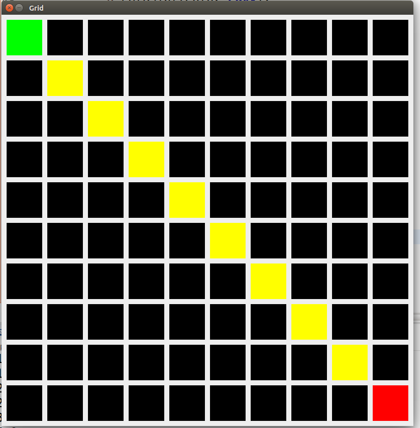

# A Pathfinding in 2D grid with A*

In a Java 2D world, make a grid where you have some obstacles (can be different colors), a starting point and an ending point.

You should implement such logic that when a button is clicked, the program should highlight the path from the starting point to the goal.

To find the path between the two points, use the [A-Star algorithm](https://en.wikipedia.org/wiki/A*_search_algorithm)

To get a good idea of what we want, look at the following pictures:

Here:

* Black tiles represent walls - you cannot go there
* Gray tiles (there are non right now) - represent walkable path.
* Green is the start tile.
* Red is the end tile.
* The yellow marks the path from start to end.

You can animate each step of the path or you can just show the entire path. It is up to you.

**You can make diagonal moves too!**

### Help

A bunch of links to get you started:

* [A great description of what A-Star is and how to use it](http://buildnewgames.com/astar/)
* [Manhattan distance for the heuristic function](https://en.wikipedia.org/wiki/Taxicab_geometry)
* You can use the PriorityQueue from Java - http://docs.oracle.com/javase/7/docs/api/java/util/PriorityQueue.html

