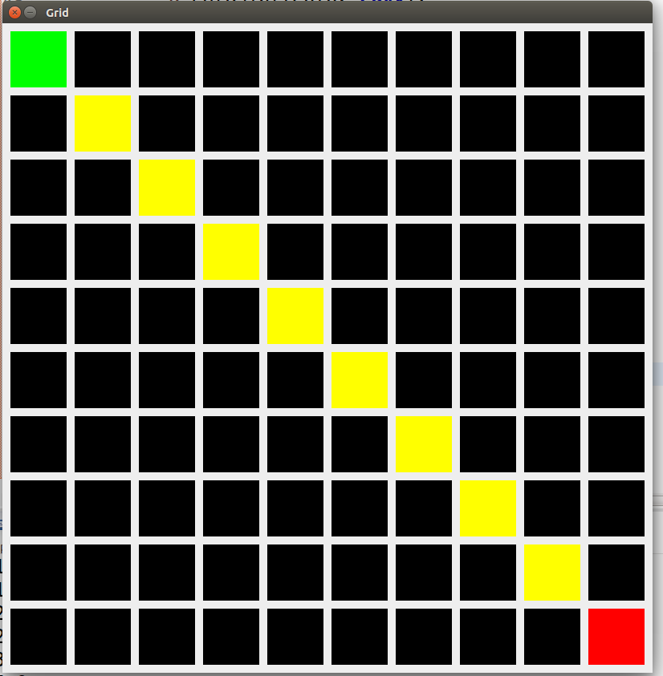

# Data Structures, Algorithms + Visualization

The main idea here is to implement an interesting data structure or algorithm and use it to create a simple application, using Swing.

You can choose one of the following scenarios:

## A Dictionary, using a Trie

You are up to the task to implement a dictionary, that gives meaning to common computer science terminology. This can be a helpful glossary for the beginners who study programming.

You want to keep a reference from an english world to a full explanation - what is the meaning of the world.

Few examples:

| Word          | Meaning       |
| ------------- |:-------------:|
| recursion     | The act of a function calling itself to solve a problem |
| function      | Something that takes input and gives output. Can be written as `f(x) = y`      |

Here are the details about that problem:

* **To implement the dictionary, use a Trie data structure**. [You can read more about Trie here](https://en.wikipedia.org/wiki/Trie)
* Make sure your save your data to a file or a database (It is up to you). Build the trie every time you start the application.
* Create a Java Swing Application ([You can use windowbuilder for help](https://eclipse.org/windowbuilder/)) that gives the ability to perform **CRUD** operations on the words and the meanings.
* Have a simple searching user interface. When a word is searched, find the meaning of the word.

**CRUD** means create, read, update, delete.

There should be options to:

* Add new word with meaning to it.
* Update an existing word of meaning.
* Remove a word with its meaning.
* Show all words and all meanings in a table.

## A Pathfinding in 2D grid with A*

In a Java 2D world, make a grid where you have some obstacles (can be different colors), a starting point and an ending point.

You should implement such logic that when a button is clicked, the program should highlight the path from the starting point to the goal.

To find the path between the two points, use the [A-Star algorithm](https://en.wikipedia.org/wiki/A*_search_algorithm)

To get a good idea of what we want, look at the following pictures:

Here:

* Black tiles represent walls - you cannot go there
* Gray tiles (there are non right now) - represent walkable path.
* Green is the start tile.
* Red is the end tile.
* The yellow marks the path from start to end.

You can animate each step of the path or you can just show the entire path. It is up to you.

## Help

You can use the PriorityQueue from Java - http://docs.oracle.com/javase/7/docs/api/java/util/PriorityQueue.html
