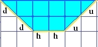
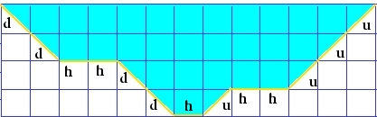
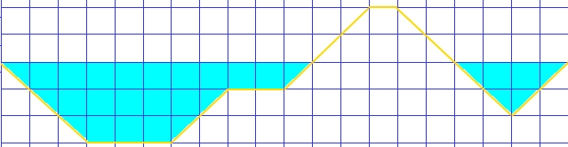

##Lakes

**We are  living in 2D world and we are running out of water!** We are migrating to **KEPLER-186F**, the new planet that NASA discovered, but it is a slow migration because that planet is far far away. 

Luckily we still have some big lakes full of clean water. We need to know exactly how much water is in every lake.

Write a program that takes the lake structure and calculates the amount of water there.

## The Input

We take a string that represents the structure of the lake.

``d`` - stands for **down**

``h`` - stands for **horizontal**

``u`` - stands for **up**

## Example 1

For input
```
ddhhuu
```

We have lake structure like this:



**Every full square is 1000 liters of water!**

So the output here obviously is:

```
8000
```

## Example 2

Of course we can have much complex lakes like this:
```
ddhhddhuhhuuu
```



If you count carefully the answer here is:
```
30000
```

## Example 3

We can have some small islands:
```
dddhhhuuhhuuuhdddduu
```



If you count carefully the answer here is:
```
24000
```