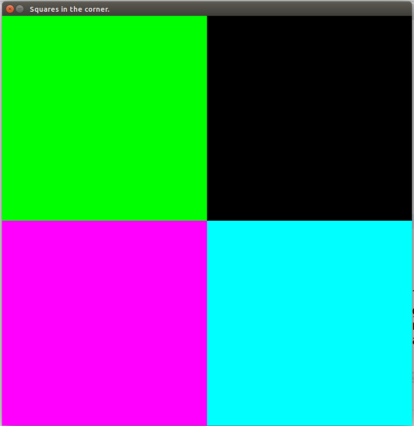

# Squares in the corner

Make a Java2D application, that is `800x800` window.

In the four corners of the window, make 4 different-colord squares.

Your application should look something like this:



## Boilerplate

To get you started, have two files: `Application.java` and `Canvas.java`.

Here is the boilerplate for `Application.java` (mind your own package):

```java
import javax.swing.JFrame;

public class Application extends JFrame {

  public Application() {
    add(new Canvas());
    
    setResizable(false);
    pack();
    
    setTitle("My application name");
    
    setDefaultCloseOperation(JFrame.EXIT_ON_CLOSE);
    setLocationRelativeTo(null);
  }
  
  public static void main(String[] args) {
    Application app = new Application();
    app.setVisible(true);
  }
}

```

Here is the boilerplate for `Canvas.java` (mind your own package):

```java
package com.hackbulgaria.programming51.week8.corner;

import java.awt.Color;
import java.awt.Dimension;
import java.awt.Graphics;
import java.awt.Graphics2D;
import java.awt.geom.Rectangle2D;

import javax.swing.JPanel;

public class Canvas extends JPanel {
  
  public static int WIDTH = 800;
  public static int HEIGHT = 800;
  
  public static int SQUARE_WIDTH = 400;
  
  public void paintComponent(Graphics g) {
    super.paintComponent(g);
    
    Graphics2D g2 = (Graphics2D) g;
    
    // an example    
    Rectangle2D.Double upLeftSquare = new Rectangle2D.Double(0, 0, SQUARE_WIDTH, SQUARE_WIDTH);
    
    g2.setPaint(Color.GREEN);
    g2.fill(upLeftSquare);
  }
  
  public Canvas() {
    setPreferredSize(new Dimension(WIDTH, HEIGHT));
  }
}

```
