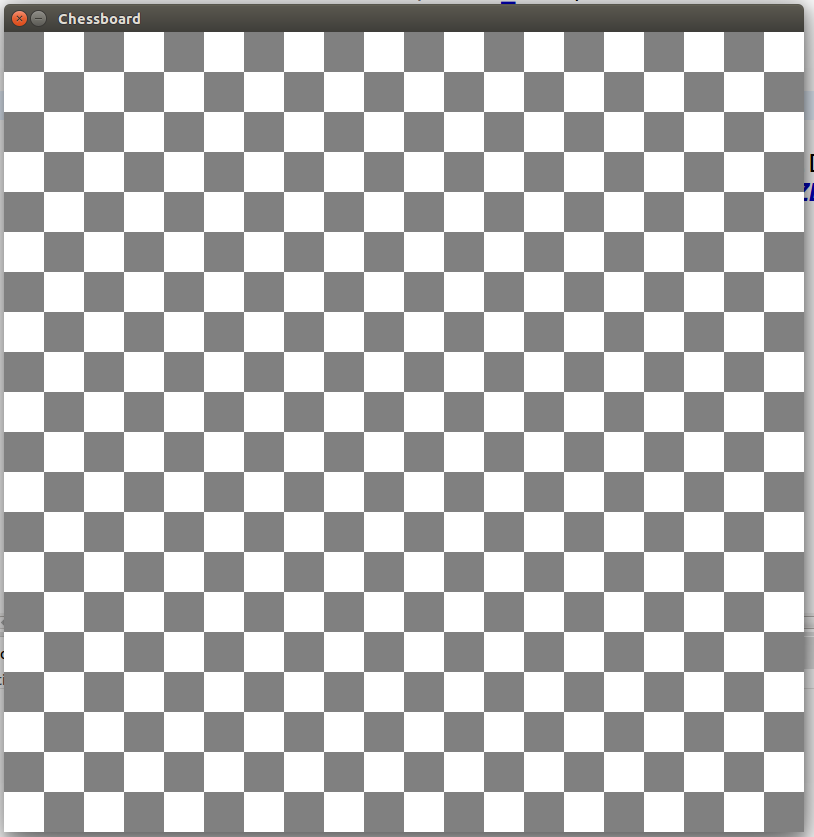

# Chessboard

Make a Java2d application that resembles a chessboard. The pattern is more important than the count of the squares.

Your application should look something like this:

You can reuse the boilerplate from the previous problem, but now you are on your own!
